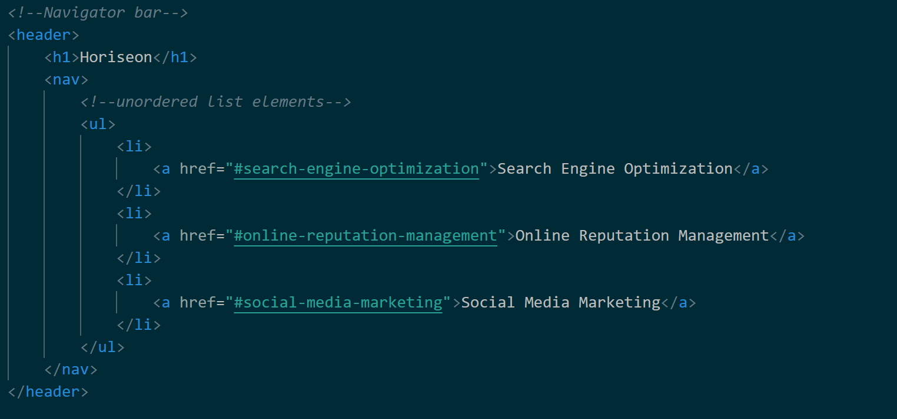
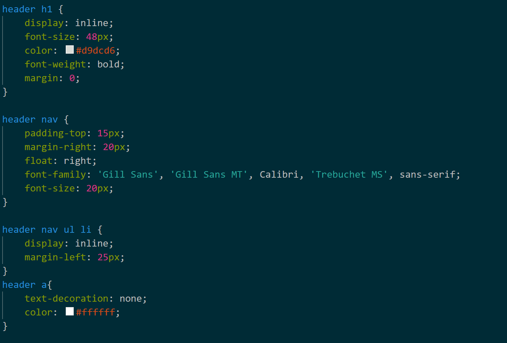
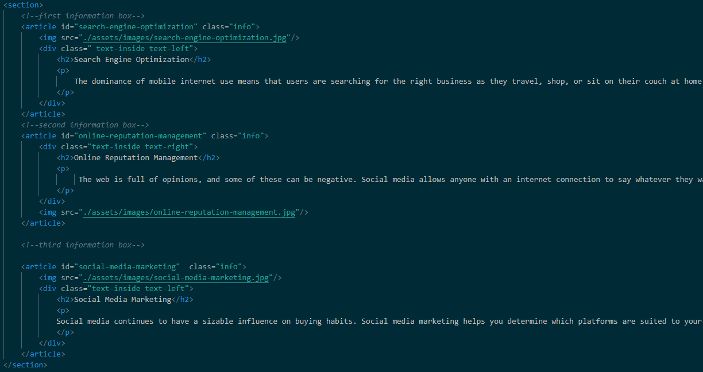
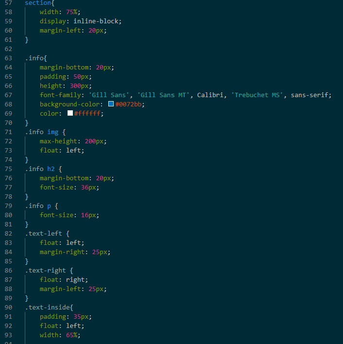
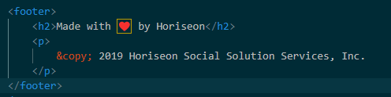

# Refactoring the existing code in accordance to the guidelines

In this project I was given a broken code that needed to be refactored in order to build a fully functional website for our client. 
The code was missing signficant structural pieces starting with the search bar where the hyperlinks were not working. 
HTML sematics needed retouching
CSS code needed formating and cleaning making it accesible for the other users and simplifying while saving the websites main fundamentals

- **Header section**
What I noticed upon opening the code was the repetition of "div" element which helps create a "containing box" for the following code but is not a great element because it doesnt not clear up what the section is and what part of the coding are we working on. So I decided to create unique elements for each section. 
- 

This make it easy for me to refactor the CSS styling sheet because now I had specific elements, classes and ID to work on
- 

- **Hero section**
My second step was adjusting the hero part which in this case was only the main background image.
- 

- **Main Section**
The main section was the most important one as I needed to create two columns and give both the right CSS styles. On the right side i made three containers all with same class and id so it would be easier to add CSS properties in block . 

- 

As you can see from the CSS having the same class names for all of them makes it easy and gives us a clean line of code. 
- 

The most challenging part was floating the img and the text on the same side for the first and third article and floating it on the right for the middle one. 

Second part was the right column which was easier to adjust as the only thing to fix was the elements of HTML.
Last but not least the footer. The original HTML had it shown as a "div" which makes it hard for the user to understand what part is it. So to do that I replaced the main div with footer element. 
- 

In the end I am pleased with the final result as all the funtions work and the websited matches more then 90% with the original broken code. 

# Final result:
- 
- 
- 

# Contributors 
- **Blerand Ismaili** <*https://github.com/BlerandIsm*>

